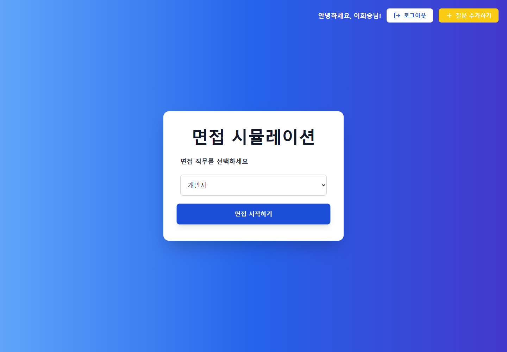
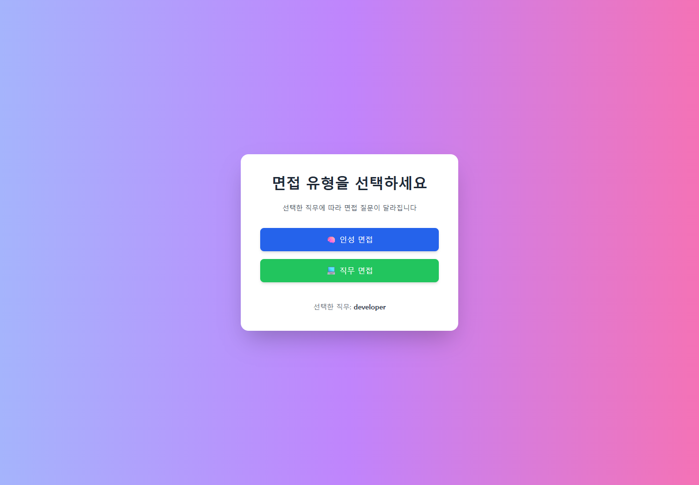
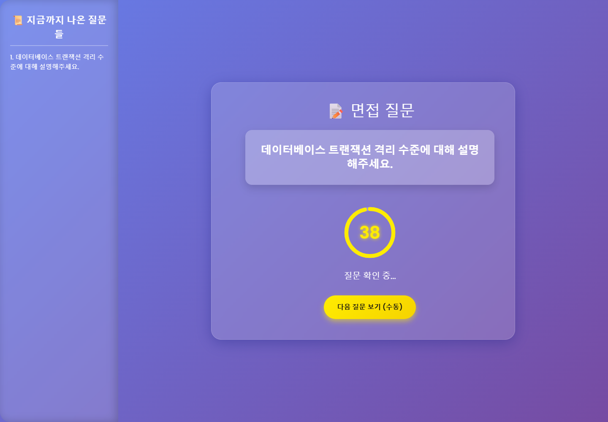
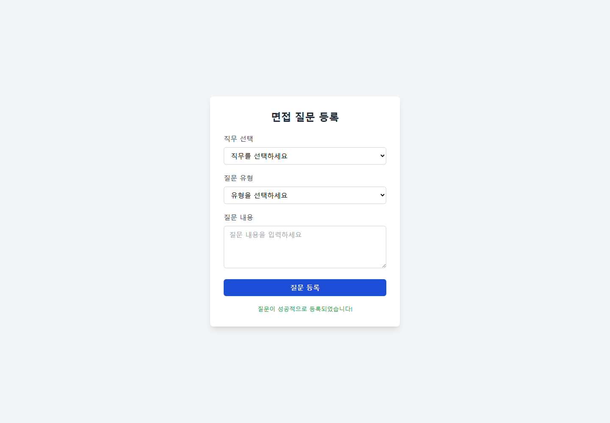

# Question - 직무 맞춤형 면접 시뮬레이션 서비스

`Question`은 면접을 준비하는 사용자가 직무와 면접 유형을 선택하고, 제한 시간 안에 답변을 연습할 수 있도록 만든 Spring Boot 기반 웹 서비스입니다.

회원가입과 로그인 이후 개발자, 디자이너, 마케팅, 영업, 반도체 엔지니어 중 직무를 선택할 수 있으며, 인성 면접과 직무 면접 유형에 따라 랜덤 질문을 제공합니다. 질문 화면에서는 40초 타이머와 질문 기록을 함께 보여주어 실제 면접처럼 답변 흐름을 연습할 수 있습니다.

## Preview

### 직무 선택



### 면접 유형 선택



### 면접 질문 및 40초 타이머



### 질문 추가



## 주요 기능

| 기능 | 설명 |
| --- | --- |
| 회원가입 | 이름, 이메일, 비밀번호, 성별, 직무, 경력, 전화번호, 나이를 입력받고 Bean Validation으로 검증합니다. |
| 로그인/로그아웃 | 이메일과 비밀번호 기반으로 로그인하고, 세션에 사용자 정보를 저장하거나 제거합니다. |
| 직무 선택 | 개발자, 디자이너, 마케팅, 영업, 반도체 엔지니어 중 면접 직무를 선택합니다. |
| 면접 유형 선택 | 인성 면접과 직무 면접 중 원하는 유형을 선택합니다. |
| 랜덤 질문 제공 | 선택한 직무와 면접 유형에 맞는 질문 목록을 섞어 랜덤 질문을 제공합니다. |
| 40초 타이머 | 질문 확인 시간 10초와 답변 시간 30초를 합쳐 제한 시간 기반 답변 연습을 지원합니다. |
| 질문 기록 | 브라우저 LocalStorage를 활용해 현재 세션에서 나온 질문 기록을 사이드바에 표시합니다. |
| 질문 추가 | 로그인 사용자가 직무/유형별 질문을 추가할 수 있는 API와 화면을 제공합니다. |

## 이번 개선 내용

- `/logout` 라우트를 추가해 로그인 사용자가 정상적으로 세션을 종료할 수 있게 했습니다.
- `질문 추가하기` 버튼의 이동 경로와 질문 등록 API(`/api/questions`)를 연결했습니다.
- 등록된 질문은 실행 중인 애플리케이션의 질문 풀에 즉시 반영되도록 `QuestionService.addQuestion()`을 구현했습니다.
- MySQL 없이도 로컬 실행과 테스트가 가능하도록 H2 기반 `demo` 프로필을 추가했습니다.
- 테스트 실행 시 `demo` 프로필을 사용하도록 설정해 로컬 DB 없이도 `contextLoads` 테스트가 통과하게 했습니다.
- 공개 저장소에 DB 비밀번호가 직접 노출되지 않도록 datasource 설정을 환경 변수 기반으로 정리했습니다.

## 기술 스택

| 영역 | 기술 |
| --- | --- |
| Backend | Java 17, Spring Boot 3.5.4, Spring MVC |
| Persistence | Spring Data JPA, MySQL, H2(demo profile) |
| Validation | Bean Validation |
| View | Thymeleaf, HTML, Tailwind CSS, JavaScript |
| State | HttpSession, LocalStorage |
| Build | Gradle |

## 핵심 구현

### Session 기반 인증 흐름

로그인 성공 시 `loginUser` 객체를 세션에 저장하고, 면접 시작과 질문 추가 화면 접근 시 로그인 여부를 확인합니다.

```java
session.setAttribute("loginUser", user);
```

로그아웃 시에는 세션을 무효화해 사용자 상태를 초기화합니다.

```java
session.invalidate();
```

### 직무/면접 유형 기반 질문 제공

`QuestionService`에서 직무와 면접 유형을 기준으로 질문 목록을 분리하고, `Collections.shuffle()`로 섞은 뒤 지정한 개수만 반환합니다.

```java
List<String> question = questionService.makeQuestion(job, type, 5);
```

### 질문 추가 API

로그인 사용자는 질문 추가 화면에서 직무, 유형, 질문 내용을 입력해 새로운 질문을 등록할 수 있습니다. 등록된 질문은 실행 중인 서비스의 질문 풀에 추가되어 이후 랜덤 질문 후보로 사용됩니다.

```http
POST /api/questions
Content-Type: application/json

{
  "job": "developer",
  "type": "technical",
  "text": "JPA 영속성 컨텍스트의 장점과 주의할 점을 설명해주세요."
}
```

### 40초 면접 타이머

질문 화면은 JavaScript로 총 40초 타이머를 제공합니다.

- 질문 확인 시간: 10초
- 답변 시간: 30초
- 남은 시간이 10초 이하일 때 경고 스타일 적용
- 시간이 종료되면 다음 질문 요청

## 프로젝트 구조

```text
src
└── main
    ├── java/com/example/interview
    │   ├── Controller/MainController.java
    │   ├── Entity/User.java
    │   ├── Entity/Question.java
    │   ├── Enum/
    │   ├── Repository/UserRepository.java
    │   └── Service/
    │       ├── QuestionService.java
    │       └── UserService.java
    └── resources
        ├── application.properties
        ├── application-demo.properties
        └── templates/
            ├── index.html
            ├── interview/
            └── user/
```

## 실행 방법

### Demo profile - MySQL 없이 실행

```bash
git clone https://github.com/boclair98/Question.git
cd Question
./gradlew bootRun --args="--spring.profiles.active=demo"
```

Windows 환경:

```bash
gradlew.bat bootRun --args="--spring.profiles.active=demo"
```

접속 주소:

```text
http://localhost:8080
```

### MySQL profile

MySQL을 사용할 경우 `interview` 데이터베이스를 만든 뒤 환경 변수로 접속 정보를 설정합니다.

```sql
CREATE DATABASE interview;
```

```properties
SPRING_DATASOURCE_URL=jdbc:mysql://localhost:3306/interview?useSSL=false&useUnicode=true&serverTimezone=Asia/Seoul
SPRING_DATASOURCE_USERNAME=YOUR_USERNAME
SPRING_DATASOURCE_PASSWORD=YOUR_PASSWORD
```

## 테스트

```bash
./gradlew test
```

Windows 환경:

```bash
gradlew.bat test
```

## 화면 흐름

```text
메인 화면
  -> 회원가입 / 로그인
  -> 직무 선택
  -> 면접 유형 선택
  -> 랜덤 질문 제공
  -> 40초 타이머 기반 답변 연습
  -> 질문 기록 확인
  -> 필요 시 질문 추가
```

## 개선 예정

- 질문 데이터를 in-memory Map이 아닌 DB 테이블로 영속화
- 비밀번호 암호화 적용
- Spring Security 기반 인증/인가 구조로 개선
- 직무/면접 유형별 질문 중복 방지 고도화
- 질문 추가 기능에 관리자 검수 플로우 적용
- 컨트롤러/서비스 단위 테스트 보강
